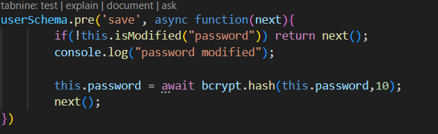
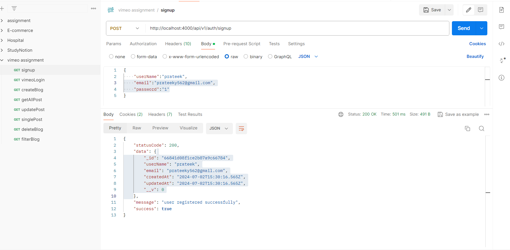
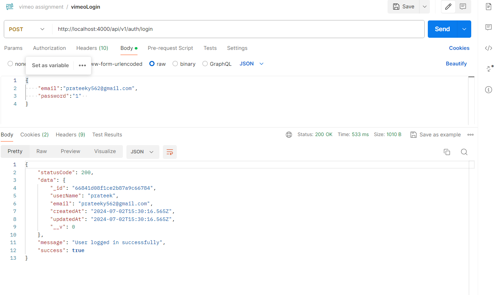
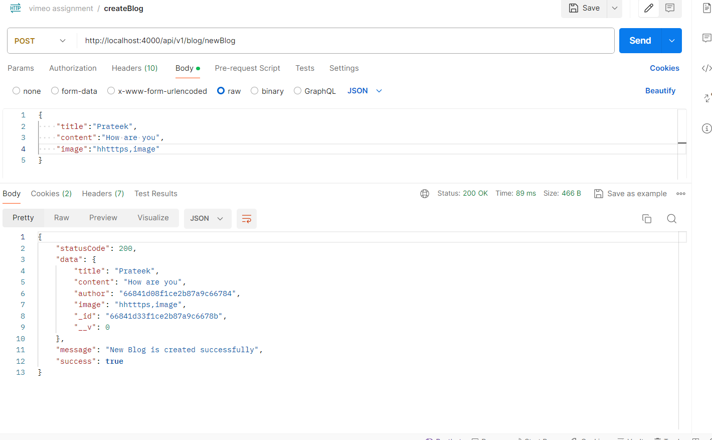
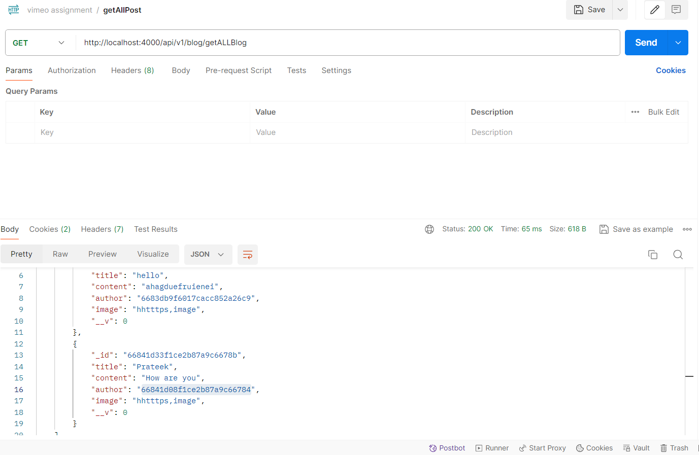
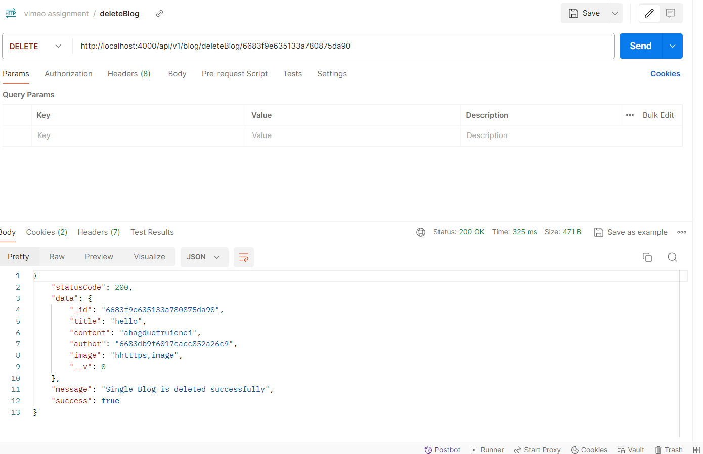

# Backend_assignment-Vizmo-

# Setup is done

## Password is changed by user 
  

  ## signup 
  

  ## login
  

  ## newBlog
  

  ## getAllblog
  

  ## singleData 
  

  ## updateBlog
  

  ## deleteBlog
  

  ## filterBlog
  